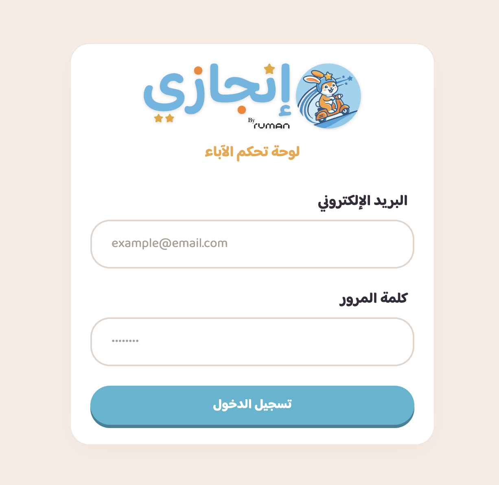
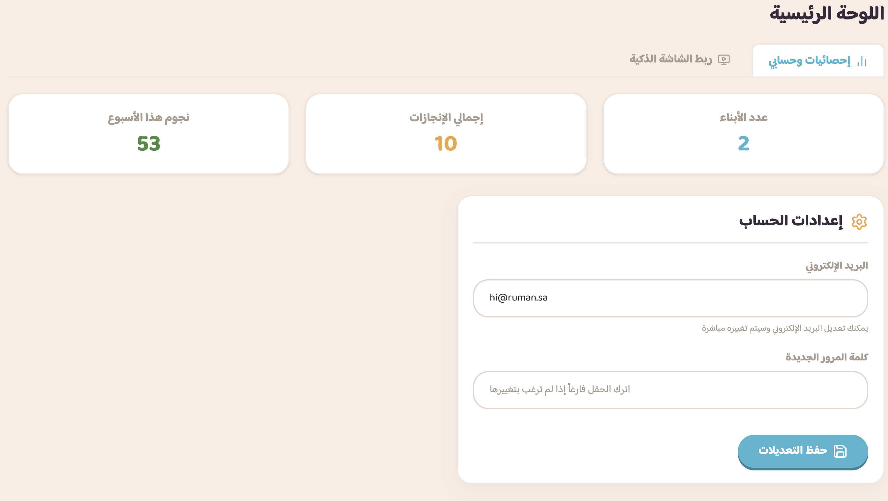
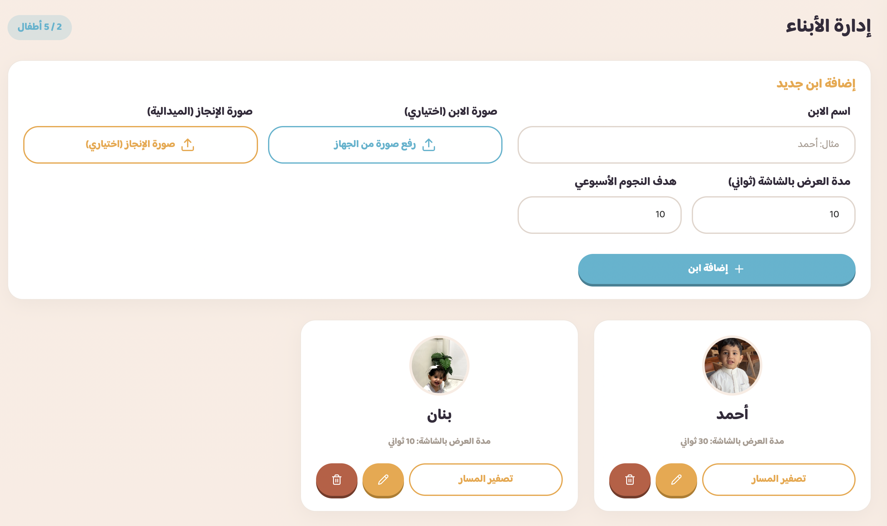
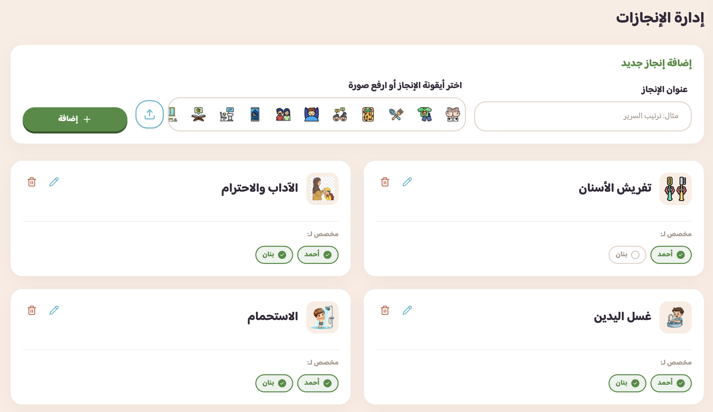
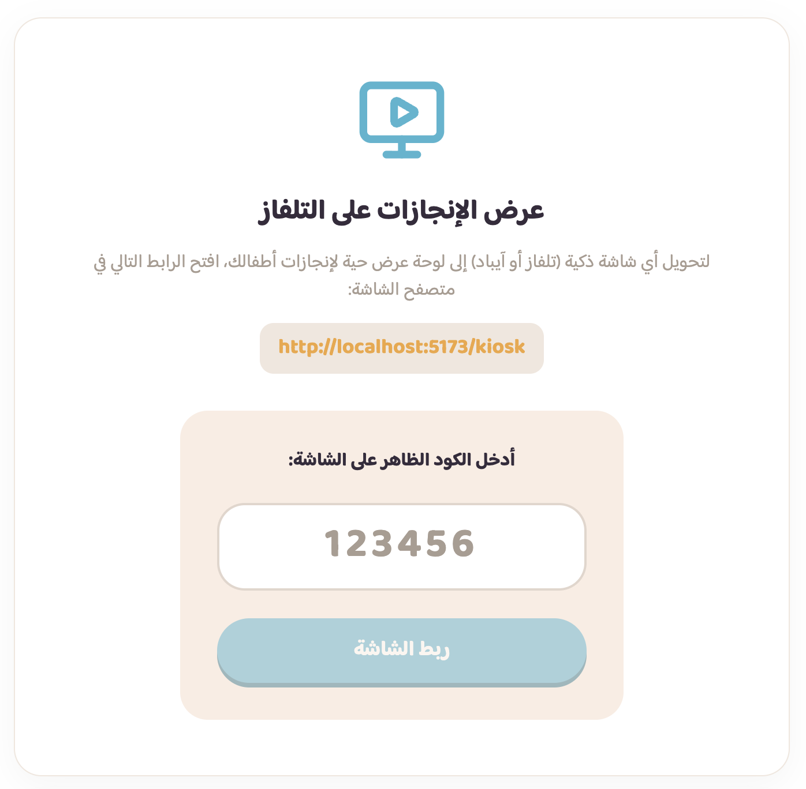

<div dir="rtl" style="text-align: right; font-family: 'Baloo Bhaijaan 2', sans-serif;">

<div align="center">
  <a href="https://ruman.sa">
    <picture>
      <source srcset="public/assets/img/H_Colored_LogoWhite@2x.png" media="(prefers-color-scheme: dark)">
      
    </picture>
  </a>
</div>

# تطبيق إنجازي Enjazy App 🚀

[](https://vitejs.dev/)
[](https://reactjs.org/)
[](https://tailwindcss.com/)
[](https://supabase.com/)

<div align="center">
  
</div>

**إنجازي** هو نظام تفاعلي متكامل يتكون من (لوحة تحكم ذكية للآباء + شاشة عرض تفاعلية للأطفال) صُمم خصيصاً لمساعدة الآباء على متابعة وتطوير إنجازات أطفالهم اليومية بأسلوب محفز، عصري، وطفولي مبهج.

## ✨ مميزات النظام والخصائص الكاملة

النظام مبني بهيكلية أدوار متعددة (سوبر أدمن، آباء، وشاشات عرض):

### 1. لوحة الإدارة العليا (Super Admin Dashboard)
- **إدارة الآباء:** السوبر أدمن هو الحساب الوحيد المخول بإنشاء حسابات جديدة للآباء وتعديلها أو حذفها.

### 2. لوحة تحكم الآباء (Parent Dashboard)

<div align="center">
  
</div>

- **اللوحة الرئيسية (Dashboard Home):** واجهة متكاملة تعرض إحصائيات عامة عن الأبناء، وتتضمن تبويباً لإدارة الحساب (تعديل الإيميل وكلمة المرور)، وتبويباً مخصصاً لإدارة الشاشات.
  <br/>
  
- **إدارة الأبناء (Children Manager):** إمكانية إضافة حتى 5 أبناء، تحديد هدف النجوم الأسبوعي، مدة ظهور الابن على شاشة العرض (بالثواني)، وتخصيص صورة شخصية للابن وصورة للإنجاز (الميدالية النهائية).
  <br/>
- **تصفير مسار الإنجاز:** إمكانية إعادة ضبط مسار الإنجاز ليبدأ الأرنب من نقطة البداية دون حذف النجوم أو السجلات السابقة، حيث يعتمد المسار على وقت التصفير لحساب النجوم الجديدة.
- **إدارة الإنجازات (Achievements Manager):** إضافة مهام وإنجازات يومية مع صور تعبيرية، وتخصيص الإنجازات لأبناء محددين.
  <br/>
- **التقييم اليومي (Daily Evaluation):** واجهة مريحة وسريعة لتقييم كل ابن يومياً (نجمة أو إكس) كحد أقصى 5 تقييمات للإنجاز الواحد في اليوم. وتتضمن الواجهة عرض حي لـ "مسار الإنجاز" متطابق مع الشاشة التفاعلية.
- **إدارة شاشات العرض (Kiosk Manager):** ربط أجهزة العرض بسهولة عبر رمز PIN أو QR Code، مدمجة الآن كعلامة تبويب داخل اللوحة الرئيسية لسهولة الوصول.
  <br/>

### 3. شاشة العرض التفاعلية للأطفال (Kiosk Display)
- **شاشة عرض تلقائية الدوران:** تقوم بعرض إنجازات الأبناء بالتناوب حسب المدة الزمنية المخصصة لكل ابن.
- **مسار الإنجاز البصري (مع دعم الميداليات المخصصة):** مسار متجاوب يمتد بين صورة الطفل على اليمين وهدفه (صورة الإنجاز أو الميدالية) على اليسار، وتتحرك الشخصية نحوه بمرونة وتجاوب دقيق عبر الشاشات.
- **تحديثات لحظية (Realtime):** تظهر النجوم وتتحرك الشخصية بشكل حي ومباشر أمام الطفل لحظة إضافة التقييم من هاتف الأب، دون الحاجة لتحديث الصفحة.
- **مؤثرات بصرية وصوتية متجاوبة:** إطلاق تأثيرات "Confetti" وأصوات تشجيعية عند النجاح، وأصوات تنبيهية عند الإخفاق أو التراجع عن التقييم.
- **تصميم متجاوب بالكامل:** يعتمد التصميم على وحدات (`clamp` و `Grid`) ليتجاوب تماماً مع جميع الشاشات (تلفاز، جهاز لوحي، أو جوال).
- **نظام أمني للشاشات:** تعمل الشاشات عبر نظام جلسات `Sessions` لا يتطلب تسجيل الدخول بكلمة المرور في التلفاز.

---

## 🛠 التقنيات المستخدمة

- **الواجهات الأمامية:** React.js, Vite
- **التصميم:** TailwindCSS v4, Framer Motion (للحركات)
- **قاعدة البيانات والواجهة الخلفية:** Supabase (PostgreSQL, Auth, Storage, Realtime)
- **الأيقونات والتأثيرات:** Lucide React, Canvas Confetti

---

## 📥 تعليمات التثبيت وإعداد بيئة العمل (Setup)

### 1. استنساخ المستودع وتثبيت الحزم:
```bash
git clone https://github.com/rumanagency/enjazyapp.git
cd enjazyapp
npm install
```

### 2. إعداد متغيرات البيئة:
قم بإنشاء ملف `.env` في المسار الرئيسي وأضف بيانات Supabase الخاصة بك:
```env
VITE_SUPABASE_URL=your_supabase_url
VITE_SUPABASE_ANON_KEY=your_supabase_anon_key
```

### 3. إعداد قاعدة البيانات (Supabase SQL Scripts):
في منصة Supabase، افتح **SQL Editor**، ثم قم بتشغيل جميع الملفات الموجودة في مجلد `supabase/` **بنفس الترتيب التالي** خطوة بخطوة:

1. `schema.sql`: بناء الهيكل الأساسي والجداول والسياسات الأولية.
2. `storage_and_fixes.sql`: إعداد قواعد التخزين (Storage Bucket) وصلاحيات رفع الصور.
3. `update_daily_records.sql`: تحديث القيود على التقييمات اليومية لتكون 5 بحد أقصى.
4. `phase5_schema.sql`: إضافة جداول الجلسات الذكية (Kiosk Sessions) والشاشات.
5. `admin_functions.sql`: دوال التحقق الأمنية لحماية أدوار المستخدمين.
6. `create_super_admin.sql`: لإنشاء حساب "السوبر أدمن" الافتراضي للنظام.
7. `add_device_info_to_kiosk.sql`: تحديث جداول الشاشة لدعم معلومات الأجهزة والمتصفحات.
8. `add_path_fields.sql`: إضافة أعمدة `path_reset_timestamp` و `weekly_star_goal` لدعم تصفير المسار وتحديد الهدف.
9. `fix_kiosk_delete.sql`: إصلاح صلاحيات الحذف لتأمين جلسات الكشك.
10. `allow_kiosk_reads.sql`: منح الشاشات (التي لا تملك حساب مستخدم تقليدي) صلاحية قراءة بيانات الأبناء والإنجازات بسلاسة مع الحفاظ على الخصوصية للآباء.
11. `add_reward_image.sql`: إضافة حقل `reward_image_url` في جدول الأبناء لدعم إمكانية رفع صورة مخصصة لهدف المسار.

### 4. حساب الإدارة العليا (Super Admin) 👑:
بعد تنفيذ جميع الأكواد السابقة سيتم إنشاء الحساب الأول تلقائياً للتحكم بالمنصة:
- **البريد الإلكتروني:** `hi@ruman.sa`
- **كلمة المرور:** `Ruman123@!`

سجل دخولك بهذا الحساب، وتوجه إلى شاشة "إدارة الآباء" لإنشاء حسابات لمنحها لعملائك أو الآباء الآخرين.

### 5. تشغيل المشروع للبيئة التطويرية:
```bash
npm run dev
```

---

## 📝 الحقوق والمطورين

تم تصميم وبرمجة هذا النظام بواسطة **صالح** من **وكالة رمان (Ruman Agency)**.

- 📧 **البريد الإلكتروني:** [hi@ruman.sa](mailto:hi@ruman.sa)
- 📱 **واتساب:** [+966539294989](https://wa.me/966539294989)
- 🌐 **الموقع الإلكتروني:** [https://ruman.sa](https://ruman.sa)

---
<div align="center">
  صُنع بحب 💖 لدعم أبنائنا وتحفيزهم
</div>
</div>
